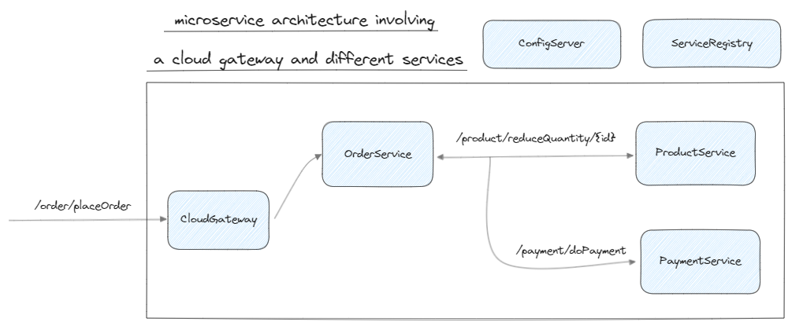

# API Documentation

This documentation provides an overview of the API endpoints for creating products, fetching product details by ID, placing orders, and retrieving order details. Each section includes the necessary `curl` commands to interact with the API.

## Base URL
The base URL for all API requests is:
```
http://localhost:9090
```

## Authentication
All API requests require an Authorization header with a Bearer token:
```
--header 'Authorization: Bearer xxxx'
```

Replace `xxxx` with your actual token.

## Endpoints

### 1. Create a Product
Creates a new product in the system.

**Endpoint:**
```
POST /product
```

**Request:**
```bash
curl --location 'http://localhost:9090/product' \
--header 'Content-Type: application/json' \
--header 'Authorization: Bearer xxxx' \
--data '{
    "name": "iPhone 15",
    "price": 2000,
    "quantity": 2
}'
```

**Request Body:**
- `name` (string): The name of the product.
- `price` (number): The price of the product.
- `quantity` (number): The quantity of the product in stock.

### 2. Fetch Product by ID
Fetches details of a product by its ID.

**Endpoint:**
```
GET /product/{id}
```

**Request:**
```bash
curl --location --request GET 'http://localhost:9090/product/103' \
--header 'Content-Type: application/json' \
--header 'Authorization: Bearer xxxx'
```

**Path Parameter:**
- `id` (number): The ID of the product to fetch.

**Note:** The request body is not required for GET requests.

### 3. Place an Order
Places an order for a product.

**Endpoint:**
```
POST /order/placeOrder
```

**Request:**
```bash
curl --location 'http://localhost:9090/order/placeOrder' \
--header 'Content-Type: application/json' \
--header 'Authorization: Bearer xxxx' \
--data '{
    "productId": 103,
    "totalAmount": 10000,
    "quantity": 1,
    "paymentMode": "CASH"
}'
```

**Request Body:**
- `productId` (number): The ID of the product to order.
- `totalAmount` (number): The total amount for the order.
- `quantity` (number): The quantity of the product to order.
- `paymentMode` (string): The payment mode for the order (e.g., "CASH").

### 4. Get Order Details
Fetches details of an order by its ID.

**Endpoint:**
```
GET /order/{id}
```

**Request:**
```bash
curl --location 'http://localhost:9090/order/2' \
--header 'Authorization: Bearer xxxx'
```

**Path Parameter:**
- `id` (number): The ID of the order to fetch.

**Note:** The request body is not required for GET requests.

---

For any questions or issues, please contact the API support team.
